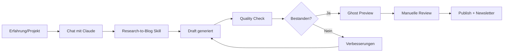

# Ghost Blog Projekt: Technologie & Souveränität für Non-Techies

## 🎯 Vision & Mission

**Vision**: Eine praxisorientierte Tech-Blog-Plattform, die komplexe Themen rund um KI, digitale Souveränität und Innovation für Non-Techies zugänglich macht.

**Mission**: Erfahrungen mit digitalen Tools und KI teilen, sodass auch nicht-technische Menschen die spannenden Entwicklungen nachvollziehen und selbst ausprobieren können.

**Thematischer Fokus**:
- 🇪🇺 Deutschland/Europa: Digitale Souveränität vs. Innovation
- 🤖 KI-Tools & praktische Anwendungen
- 🔧 Hands-on Tutorials zum Nachbauen
- 💡 Innovation zugänglich gemacht
- 🛡️ Datenschutz & Self-Hosting

**Inspiration**: https://www.metacheles.de/ (aber praxisbezogener und zugänglicher)

---

## 📋 Projekt-Übersicht

### Technologie-Stack

**Core-Platform**:
- **Ghost CMS** (selbstgehostet auf IONOS VPS)
- **Node.js** (aktuelle LTS-Version)
- **MySQL/SQLite** (je nach Performance-Bedarf)
- **Nginx** (Reverse Proxy & SSL)

**Automatisierung & KI**:
- **Ghost MCP Server** für Claude-Integration
- **Claude Skills** (customized für Content-Erstellung)
- **GitHub** für Version Control & Backup

**Deployment**:
- **IONOS VPS** (siehe Empfehlung unten)
- **Docker** (optional für einfacheres Deployment)
- **SSL/TLS** via Let's Encrypt

---

## 🖥️ VPS-Empfehlung: IONOS

### ✅ Empfohlen: VPS S (2€/Monat für 24 Monate)

**Spezifikationen**:
- 2 vCores CPU
- 2 GB RAM
- 80 GB NVMe
- Einrichtung: 10€

**Begründung**:
1. **Ghost Minimum Requirements**: Node.js braucht mindestens 1GB RAM, empfohlen 2GB+
2. **Email-Service**: Zusätzlicher RAM für Mailgun/SMTP-Integration
3. **Wachstumspotenzial**: Platz für Traffic-Wachstum und Media-Files
4. **Preis-Leistung**: Nur 1€ mehr als XS, aber doppelte Ressourcen
5. **80GB Storage**: Ausreichend für Jahre an Blog-Content + Backups

### ⚠️ VPS XS - NICHT empfohlen
- 1GB RAM ist zu knapp für Ghost + MySQL + Nginx
- 10GB Storage füllt sich schnell mit Media/Backups
- Performance-Probleme bei Traffic-Spitzen

### 🚀 VPS M - Optional für später
- Upgrade-Path wenn Traffic stark wächst
- Sinnvoll bei >10.000 Besuchern/Monat
- Mehrere Ghost-Instanzen oder zusätzliche Services

---

## 🏗️ Architektur & Setup

### Phase 0: Lokales Development Setup (Woche 1)

**Strategie**: Komplettes Ghost-Setup lokal entwickeln, während VPS bestellt wird. Dann via GitHub CI/CD auf Server deployen.

**Vorteile**:
- ✅ Token-Sparend: Ghost MCP Server nur für finale Tests nutzen
- ✅ Schnelleres Development: Keine Server-Wartezeiten
- ✅ Sauberes Deployment: Von GitHub → Production in einem Schritt
- ✅ Lokale Experimente: Risk-free Testing

#### 0.1 Lokale Ghost Installation (Windows)

**Option A: Ghost-CLI lokal** (Empfohlen)
```bash
# Node.js installieren (falls nicht vorhanden)
# Download von: https://nodejs.org/ (LTS Version)

# Ghost CLI installieren
npm install ghost-cli@latest -g

# Lokales Verzeichnis erstellen
mkdir ghost-local
cd ghost-local

# Ghost lokal installieren
ghost install local

# Ghost starten
ghost start

# Läuft auf: http://localhost:2368
# Admin: http://localhost:2368/ghost
```

**Option B: Docker** (Alternative für einfacheres Setup)
```bash
# Docker Desktop für Windows installieren
# Dann:
docker run -d \
  --name ghost-local \
  -p 2368:2368 \
  -v ghost-content:/var/lib/ghost/content \
  ghost:latest

# Läuft auf: http://localhost:2368
```

#### 0.2 GitHub Repository Setup

```bash
# Neues Repository erstellen
git init
git remote add origin https://github.com/deinusername/ghost-blog.git

# Repository-Struktur:
ghost-blog/
├── .github/
│   └── workflows/
│       └── deploy.yml          # CI/CD Pipeline
├── content/
│   ├── themes/
│   │   └── custom-theme/       # Dein Custom Theme
│   ├── data/                   # Ghost Exports (JSON)
│   └── images/                 # Media Files
├── config.production.json      # Production Config (Template)
├── ghost-backup-script.sh      # Backup Automation
└── README.md
```

#### 0.3 Content-Entwicklung (Token-Sparend!)

**OHNE Ghost MCP Server**:
```markdown
# Strategie: Markdown-First Approach

1. Blog-Posts als Markdown-Files schreiben
2. Claude nutzt normale Read/Write Tools (keine MCP-Tokens!)
3. Posts lokal in Ghost importieren
4. Finale Qualitätsprüfung
5. Export für Production

# File-Struktur:
content/posts/
├── 2025-01-01-erster-post.md
├── 2025-01-05-claude-tutorial.md
└── drafts/
    └── naechster-post.md
```

**Ghost Import**:
```bash
# Posts via Ghost Admin UI importieren
# Oder: Ghost Content API (nur wenn nötig)
```

**Deliverables Phase 0**:
- ✅ Ghost läuft lokal auf http://localhost:2368
- ✅ GitHub-Repository erstellt & initialisiert
- ✅ 5-10 Test-Posts als Markdown geschrieben
- ✅ Custom Theme-Basis konfiguriert
- ✅ CI/CD Pipeline vorbereitet (noch nicht aktiv)

---

### Phase 1: VPS Setup & Deployment (Woche 2)

**Parallel**: Während Phase 0 läuft, VPS bestellen

#### 1.1 VPS Basis-Konfiguration
```bash
# Nach VPS-Bereitstellung durch IONOS

# SSH-Verbindung
ssh root@deine-server-ip

# System Update
apt update && apt upgrade -y

# Firewall
ufw allow 22/tcp   # SSH
ufw allow 80/tcp   # HTTP
ufw allow 443/tcp  # HTTPS
ufw enable

# Security
apt install fail2ban -y
apt install unattended-upgrades -y

# Non-root User erstellen
adduser ghostuser
usermod -aG sudo ghostuser
```

#### 1.2 Ghost Production Installation
```bash
# Als ghostuser:
su - ghostuser

# Node.js installieren (via NodeSource)
curl -fsSL https://deb.nodesource.com/setup_lts.x | sudo -E bash -
sudo apt install -y nodejs

# Ghost CLI
sudo npm install ghost-cli@latest -g

# Ghost installieren
sudo mkdir -p /var/www/ghost
sudo chown ghostuser:ghostuser /var/www/ghost
cd /var/www/ghost

ghost install

# Setup-Fragen:
# - Blog URL: https://deine-domain.de
# - MySQL: Ja (automatisch konfiguriert)
# - Nginx: Ja (automatisch)
# - SSL: Ja (Let's Encrypt)
# - Systemd: Ja (Auto-Start)
```

#### 1.3 GitHub CI/CD Pipeline

**`.github/workflows/deploy.yml`**:
```yaml
name: Deploy to Production

on:
  push:
    branches: [ main ]
  workflow_dispatch:

jobs:
  deploy:
    runs-on: ubuntu-latest
    steps:
      - uses: actions/checkout@v3

      - name: Deploy Theme to Server
        uses: easingthemes/ssh-deploy@main
        env:
          SSH_PRIVATE_KEY: ${{ secrets.SSH_PRIVATE_KEY }}
          REMOTE_HOST: ${{ secrets.REMOTE_HOST }}
          REMOTE_USER: ghostuser
          SOURCE: "content/themes/custom-theme/"
          TARGET: "/var/www/ghost/content/themes/custom-theme/"

      - name: Restart Ghost
        uses: appleboy/ssh-action@master
        with:
          host: ${{ secrets.REMOTE_HOST }}
          username: ghostuser
          key: ${{ secrets.SSH_PRIVATE_KEY }}
          script: |
            cd /var/www/ghost
            ghost restart

      - name: Import Content (if changed)
        # Optional: Auto-Import von Posts via API
        # Nur bei Bedarf aktivieren
```

**Secrets in GitHub einrichten**:
- `SSH_PRIVATE_KEY`: SSH-Key für Server-Zugang
- `REMOTE_HOST`: Server-IP oder Domain
- `GHOST_API_KEY`: Für Content-Import (optional)

**Deliverables Phase 1**:
- ✅ VPS komplett konfiguriert
- ✅ Ghost läuft unter https://deine-domain.de
- ✅ SSL-Zertifikat aktiv
- ✅ CI/CD Pipeline funktioniert
- ✅ Erster Deployment-Test erfolgreich

---

### Phase 2: Ghost MCP Integration (Optional - Nur für spezielle Workflows)

**⚠️ Token-Hinweis**: Ghost MCP Server verbraucht viele Tokens! Nur für spezielle Aufgaben nutzen.

**Wann Ghost MCP nutzen**:
- ✅ Automatisches Publishing zeitgesteuerter Posts
- ✅ Member-Management & Newsletter-Automation
- ✅ Bulk-Operations (z.B. Tags zu vielen Posts hinzufügen)
- ❌ NICHT für normales Content-Writing (nutze Markdown-Files!)

#### 2.1 Ghost MCP Server Setup

**Repository**: https://github.com/MFYDev/ghost-mcp

**Funktionen**:
- 🔐 Secure Ghost Admin API requests
- 📝 Posts, Tags, Newsletter Management
- 👥 Members & Users Management
- 💰 Tiers & Offers (für Subscriptions)
- 🔗 Webhooks Integration

**Setup-Schritte** (nur bei Bedarf):
```bash
# MCP Server Installation
git clone https://github.com/MFYDev/ghost-mcp
cd ghost-mcp
npm install
npm run build

# Konfiguration (.env)
GHOST_API_URL=http://localhost:2368  # Lokal
# GHOST_API_URL=https://deine-domain.de  # Production
GHOST_ADMIN_API_KEY=dein-api-key
GHOST_API_VERSION=v5.0
```

**API-Key generieren**:
```
1. Ghost Admin → Settings → Integrations
2. "Add custom integration"
3. Name: "Claude MCP"
4. Copy Admin API Key
```

#### 2.2 Claude Integration (Optional)

**Claude Config** (`.claude/mcp_settings.json`):
```json
{
  "mcpServers": {
    "ghost": {
      "command": "node",
      "args": ["C:/path/to/ghost-mcp/build/index.js"],
      "env": {
        "GHOST_API_URL": "http://localhost:2368",
        "GHOST_ADMIN_API_KEY": "xxx:xxx"
      },
      "disabled": true  // Nur bei Bedarf aktivieren!
    }
  }
}
```

**Token-Spar-Strategie**:
```markdown
# Standard-Workflow (KEIN MCP):
1. Posts als Markdown schreiben
2. Via Ghost Admin UI importieren
3. Manuell veröffentlichen

# MCP-Workflow (NUR bei Bedarf):
1. Aktiviere MCP Server
2. Nutze für spezielle Automation
3. Deaktiviere wieder

# Beispiel: Newsletter an alle Member
- MCP aktivieren
- Claude: "Sende Newsletter XYZ an alle aktiven Member"
- MCP deaktivieren
```

**Deliverables Phase 2**:
- ✅ Ghost MCP Server installiert (aber disabled)
- ✅ API-Keys generiert
- ✅ Dokumentation für Token-sparenden Workflow
- ✅ Test: Ein Post via MCP (dann wieder auf Markdown umstellen)

---

### Phase 3: Content-Automatisierung (Woche 4-5)

#### 3.1 Custom Claude Skills

**Skill 1: Blog-Post-Writer**
```
Zweck: Qualitätsgeprüfte Blog-Posts erstellen
Input: Thema, Zielgruppe (Non-Techies), Tonalität
Output: Vollständiger Draft mit:
  - SEO-optimierter Titel
  - Einleitung (Hook für Non-Techies)
  - Strukturierte Sections mit Praxis-Beispielen
  - Screenshots/Visuals-Platzhalter
  - Call-to-Action
  - Meta-Description
```

**Skill 2: Tutorial-Generator**
```
Zweck: Step-by-step Tutorials für Non-Techies
Features:
  - Klare Nummerierung
  - Screenshots bei jedem Schritt
  - "Was kann schiefgehen?"-Boxen
  - Vorher/Nachher-Vergleiche
  - Schwierigkeitsgrad-Einschätzung
```

**Skill 3: Research-to-Blog**
```
Zweck: Eigene Erfahrungen dokumentieren
Input: Chat-Transkripte von eigenen Projekten
Output:
  - Lessons Learned
  - Häufige Fehler
  - Best Practices
  - Vereinfachte Erklärungen
```

#### 3.2 Qualitätssicherung

**Automatische Checks**:
- ✅ Lesbarkeitsscore (Flesch-Reading-Ease)
- ✅ Keine Fachjargon ohne Erklärung
- ✅ Mindestens 1 Praxis-Beispiel pro 500 Wörter
- ✅ Links zu weiterführenden Ressourcen
- ✅ SEO-Optimierung (Meta, Alt-Tags, etc.)

**Review-Workflow**:
1. Claude generiert Draft
2. Automatische Qualitätschecks
3. Preview in Ghost
4. Manuelle Review & Adjustments
5. Zeitgesteuertes Publishing

**Deliverables**:
- ✅ 3 Custom Skills funktionsfähig
- ✅ Automatisierter Quality-Check-Workflow
- ✅ 5 Test-Posts als Proof-of-Concept

---

### Phase 4: Email Subscriptions (Woche 6-7)

#### 4.1 Email-Service Integration

**Option A: Mailgun** (Empfohlen für Start)
- Kostenloses Tier: 5.000 Emails/Monat
- Einfache Ghost-Integration
- EU-Server verfügbar (DSGVO)

**Option B: SendGrid**
- Kostenloses Tier: 100 Emails/Tag
- Gute Analytics

**Option C: Self-Hosted (Fortgeschritten)**
- Postfix + Dovecot
- Volle Kontrolle, aber komplex

#### 4.2 Newsletter-Strategie

**Newsletter-Types**:
1. **Weekly Digest**: Neue Posts + Kurzfassung
2. **Deep-Dive**: Monatlich ein Thema ausführlich
3. **Quick-Wins**: Kurze Tipps & Tricks

**Segmentierung**:
- Anfänger vs. Fortgeschrittene
- Themen-Interessen (KI, Self-Hosting, EU-Tech, etc.)
- Engagement-Level

**Automation**:
```javascript
// Ghost MCP + Claude Workflow
1. Neuer Post wird published
2. Webhook triggert Claude
3. Claude erstellt Newsletter-Version
4. Automatisches Scheduling
5. Personalisierung nach Member-Segmenten
```

**Deliverables**:
- ✅ Email-Service konfiguriert & getestet
- ✅ Newsletter-Templates erstellt
- ✅ Automatisierter Newsletter-Workflow
- ✅ DSGVO-konforme Subscription-Forms

---

### Phase 5: Theme & Branding (Woche 8)

#### 5.1 Custom Ghost Theme

**Basis**: Casper Theme (Ghost Default) als Fork

**Customizations**:
- 🎨 Eigenes Farbschema (EU-Flaggen-Farben?)
- 📱 Mobile-First Design
- 🔍 Verbesserte Navigation (Themen-Filter)
- 💬 Kommentar-System (z.B. Commento/Utterances)
- 🌓 Dark/Light Mode Toggle

**Key-Pages**:
1. **Homepage**: Featured Posts + Kategorien
2. **Über mich**: Deine Mission & Hintergrund
3. **Tutorials**: Filterable Liste
4. **Newsletter**: Subscription-Landing-Page
5. **Resources**: Link-Sammlung zu Tools

#### 5.2 Content-Structure

**Kategorien (Tags)**:
- 🤖 KI & Automation
- 🇪🇺 Digitale Souveränität
- 🔧 Self-Hosting Tutorials
- 💡 Innovation & Tools
- 🛡️ Privacy & Security
- 📚 Für Einsteiger

**Post-Types**:
- Tutorial (mit Schwierigkeitsgrad)
- Erfahrungsbericht
- Tool-Review
- News & Kommentar
- Quick-Tip

**Deliverables**:
- ✅ Custom Theme deployed
- ✅ Alle Key-Pages erstellt
- ✅ Kategorie-System implementiert
- ✅ Navigation optimiert

---

## 🤖 Content-Strategie mit Claude

### Workflow: Von Erfahrung zu Blog-Post



### Content-Ideen aus deinen Projekten

**Basierend auf deinen bisherigen Chats**:
1. "Claude Code für Anfänger: So automatisierst du deine ersten Workflows"
2. "MCP Server erklärt: Wie KI mit deinen Tools spricht"
3. "Ghost Blog selbst hosten: Schritt-für-Schritt ohne Vorkenntnisse"
4. "EU-Cloud vs. US-Cloud: Was bedeutet das für deine Daten?"
5. "Docker für Non-Techies: Container einfach erklärt"

### Publishing-Rhythmus

**Start (Monat 1-3)**:
- 1 Tutorial pro Woche
- 1 Erfahrungsbericht pro Monat
- 1 Quick-Tip pro Woche

**Etabliert (Monat 4+)**:
- 2 Posts pro Woche
- 1 Deep-Dive pro Monat
- Newsletter jeden Sonntag

---

## 🔒 Security & DSGVO

### Security-Maßnahmen

**Server-Level**:
```bash
# Firewall
ufw allow 22/tcp  # SSH
ufw allow 80/tcp  # HTTP
ufw allow 443/tcp # HTTPS
ufw enable

# Fail2ban
apt install fail2ban
# SSH Brute-Force Protection

# Automatische Updates
unattended-upgrades
```

**Ghost-Level**:
- Starke Admin-Passwörter (Password Manager)
- 2FA für Admin-Login
- Regelmäßige Backups (täglich)
- Rate-Limiting für API

### DSGVO-Compliance

**Erforderlich**:
- ✅ Impressum (Generator: z.B. eRecht24)
- ✅ Datenschutzerklärung
- ✅ Cookie-Consent (wenn Analytics)
- ✅ Email-Subscription Double-Opt-In
- ✅ Member-Daten auf EU-Servern
- ✅ Recht auf Datenlöschung (Ghost-Feature)

**Analytics** (DSGVO-konform):
- Plausible Analytics (Self-Hosted oder EU)
- Matomo (Self-Hosted)
- KEIN Google Analytics ohne Consent-Tool

---

## 💾 Backup-Strategie

### Automatische Backups

**Ghost-Content**:
```bash
# Täglich via Cron
0 2 * * * ghost backup --dir /backup/ghost

# GitHub Auto-Sync
- Alle Posts als JSON
- Theme-Files
- Konfiguration
```

**Datenbank**:
```bash
# MySQL Dump täglich
0 3 * * * mysqldump ghost_prod > /backup/db/ghost_$(date +\%Y\%m\%d).sql

# Retention: 7 Tage lokal, 30 Tage offsite
```

**Offsite-Backup**:
- IONOS Object Storage (EU)
- Hetzner Storage Box
- GitHub (für Content)

**Restore-Test**: Quartalsweise

---

## 📊 Monitoring & Analytics

### Performance-Monitoring

**Tools**:
- **UptimeRobot**: Server-Verfügbarkeit (kostenlos)
- **Netdata**: System-Monitoring (RAM, CPU, Disk)
- **Ghost Admin**: Built-in Analytics

**Key-Metrics**:
- Server-Uptime (Ziel: >99.5%)
- Page Load Time (<2s)
- Memory Usage (<80%)
- Disk Space

### Content-Analytics

**Tracking** (DSGVO-konform):
- Post-Views
- Newsletter Open-Rate
- Member Growth
- Popular Topics

**KPIs**:
- Monthly Active Readers
- Email-Subscriber Growth
- Engagement-Rate
- Tutorial Completion (via Comments/Feedback)

---

## 🗓️ Projektplan: Timeline (Überarbeitet - Lokales Setup First!)

### Woche 1: Lokales Development Setup
**Du**: VPS S bei IONOS bestellen (läuft parallel)

**Wir gemeinsam**:
- [ ] Node.js lokal installieren (falls nötig)
- [ ] Ghost lokal installieren (`ghost install local`)
- [ ] GitHub-Repository erstellen (`ghost-blog`)
- [ ] Repository-Struktur aufsetzen
- [ ] Ersten Test-Post als Markdown schreiben
- [ ] Ghost Admin UI erkunden

### Woche 2: Content-Entwicklung & VPS Deployment
**Content** (Token-sparend mit Markdown):
- [ ] 5-10 Blog-Posts als Markdown-Files schreiben
- [ ] Custom Theme-Basis konfigurieren
- [ ] Kategorien/Tags definieren
- [ ] Key-Pages erstellen (Über mich, etc.)

**VPS** (sobald bereit):
- [ ] SSH-Zugang testen
- [ ] Ubuntu Server Setup + Security-Hardening
- [ ] Domain/Subdomain DNS konfigurieren
- [ ] Ghost Production installieren & SSL einrichten
- [ ] GitHub CI/CD Pipeline einrichten
- [ ] Erster Deployment-Test

### Woche 3: Theme & Branding
- [ ] Custom Theme basierend auf Casper forken
- [ ] Farbschema & Branding implementieren
- [ ] Navigation optimieren
- [ ] Mobile-Responsive testen
- [ ] DSGVO-Seiten (Impressum, Datenschutz)
- [ ] Theme via CI/CD deployen

### Woche 4: Email & Newsletter Setup
- [ ] Mailgun-Account erstellen (EU-Region)
- [ ] Email-Service in Ghost konfigurieren
- [ ] Newsletter-Templates designen
- [ ] Subscription-Forms auf Key-Pages
- [ ] Test-Newsletter versenden
- [ ] Double-Opt-In testen

### Woche 5-6: Content-Automatisierung
- [ ] Custom Skill: Blog-Post-Writer erstellen
- [ ] Custom Skill: Tutorial-Generator erstellen
- [ ] Custom Skill: Research-to-Blog erstellen
- [ ] Quality-Check-Workflow implementieren
- [ ] 10 weitere Posts generieren & reviewen
- [ ] Ghost MCP installieren (disabled, für später)

### Woche 7: Soft-Launch Vorbereitung
- [ ] 20+ Posts fertig & importiert
- [ ] Analytics einrichten (Plausible/Matomo)
- [ ] SEO-Optimierung (Meta-Tags, etc.)
- [ ] Performance-Test & Optimierung
- [ ] Backup-Strategie testen
- [ ] Final-Review aller Seiten

### Woche 8: Launch & Marketing
- [ ] Soft-Launch: Blog live schalten
- [ ] Ersten Newsletter verschicken
- [ ] Social-Media-Accounts erstellen
- [ ] Community-Feedback sammeln
- [ ] Erste Blog-Shares pushen
- [ ] Marketing-Plan für Monat 1-3

### Woche 9-10: Optimization & Growth
- [ ] Performance-Monitoring auswerten
- [ ] A/B-Testing (Headlines, CTAs)
- [ ] SEO-Anpassungen basierend auf Daten
- [ ] Community-Features erweitern
- [ ] Feedback in Content-Strategie einbauen
- [ ] Nächste 10 Posts planen

---

## 💰 Kostenübersicht

### Laufende Kosten (monatlich)

| Posten | Kosten | Notizen |
|--------|--------|---------|
| **IONOS VPS S** | 2€ | 24 Monate, dann 2,50€ |
| **Domain** | ~1€ | .de Domain |
| **Email (Mailgun)** | 0€ | Bis 5.000 Emails/Monat |
| **Backups (optional)** | 0-5€ | IONOS Object Storage |
| **Total** | **~3€/Monat** | Extrem günstig! |

### Einmalige Kosten

| Posten | Kosten |
|--------|--------|
| VPS Einrichtung | 10€ |
| Domain (Jahr 1) | ~12€ |
| **Total** | **~22€** |

### Skalierungs-Kosten (später)

- **VPS M Upgrade**: 3€/Monat (bei >10k Besuchern)
- **Mailgun Paid**: ab 35$/Monat (bei >5k Emails)
- **Premium-Theme**: 0-100€ (optional)

---

## 🚀 Quick-Start Checkliste

### Was du jetzt brauchst:

#### Von IONOS bestellen:
- [x] **VPS S** (2 vCores, 2GB RAM, 80GB) - 2€/Monat
- [ ] **Domain** (z.B. dein-blog.de) - ~1€/Monat

#### Vorbereiten:
- [ ] Email-Adresse für Admin-Account
- [ ] GitHub-Account (falls nicht vorhanden)
- [ ] Mailgun-Account erstellen
- [ ] Blog-Name & Slogan überlegen
- [ ] 3-5 erste Post-Ideen sammeln

#### Nach VPS-Bereitstellung:
- [ ] SSH-Zugang testen
- [ ] Diesem Guide folgen: https://ghost.org/docs/install/ubuntu/
- [ ] Claude um Hilfe bei jedem Schritt bitten

---

## 📚 Ressourcen & Links

### Offizielle Dokumentation
- **Ghost Docs**: https://ghost.org/docs/
- **Ghost API**: https://ghost.org/docs/admin-api/
- **Ghost Themes**: https://ghost.org/docs/themes/

### Tools & Services
- **Ghost MCP Server**: https://github.com/MFYDev/ghost-mcp
- **Ghost CLI**: https://ghost.org/docs/ghost-cli/
- **Mailgun**: https://www.mailgun.com/
- **Let's Encrypt**: https://letsencrypt.org/

### Community
- **Ghost Forum**: https://forum.ghost.org/
- **Ghost Discord**: https://ghost.org/discord/
- **r/ghost**: https://reddit.com/r/ghost/

### Inspiration
- **Metacheles**: https://www.metacheles.de/
- **Ghost Showcase**: https://ghost.org/customers/

---

## 🎯 Erfolgskriterien

### Technisch
- ✅ Blog läuft stabil (>99% Uptime)
- ✅ Page Load < 2 Sekunden
- ✅ Automatische Backups funktionieren
- ✅ SSL/Security A-Rating (SSL Labs)
- ✅ DSGVO-konform

### Content
- ✅ 20 Posts nach 3 Monaten
- ✅ Mindestens 1 Tutorial pro Woche
- ✅ Quality-Score >80% (Lesbarkeit)
- ✅ Positive Feedback von Non-Techies

### Community
- ✅ 100 Email-Subscriber nach 6 Monaten
- ✅ 500 monatliche Besucher nach 6 Monaten
- ✅ 5+ Kommentare pro Post
- ✅ Social-Media-Shares

---

## 🔮 Zukunfts-Features (Phase 2)

### Nach erfolgreichem Launch:

1. **Community-Features**:
   - Forum/Diskussionsbereich
   - Member-only Content
   - Paid Memberships (Tiers)

2. **Erweiterte Automation**:
   - Auto-Translation (DE/EN)
   - Social-Media Auto-Posting
   - Content-Kalender mit AI-Vorschlägen

3. **Multi-Media**:
   - Podcast-Integration
   - Video-Tutorials (YouTube-Embed)
   - Interactive Code-Examples

4. **Monetarisierung** (optional):
   - Premium-Tutorials
   - Consulting/Workshops
   - Affiliate-Links zu empfohlenen Tools

---

## 🤝 Nächste Schritte - LOS GEHT'S!

### Sofort (Heute):
1. **VPS bestellen**: IONOS VPS S (2€/Monat) - läuft im Hintergrund
2. **Domain festlegen**: Welchen Namen möchtest du? (z.B. tech-souveraen.de, praxis-digital.de)
3. **Node.js checken**: Ist Node.js bereits installiert? (`node --version` in cmd)

### Woche 1 - Parallel-Strategie:
**Du parallel** (während VPS-Bereitstellung):
- IONOS-Bestellung aufgeben
- Domain-Name festlegen
- 10 erste Post-Ideen sammeln

**Wir gemeinsam**:
- Ghost lokal installieren (`ghost install local`)
- GitHub-Repository erstellen
- Ersten Markdown-Post schreiben
- Theme anschauen & planen

### Token-Spar-Workflow für uns:
```markdown
# Ab jetzt Standard-Vorgehen:

1. Posts schreibe ich als Markdown-Files (normale Write-Tools!)
2. Du importierst sie in Ghost Admin UI
3. Ghost MCP nutzen wir nur für:
   - Newsletter-Versand
   - Member-Management
   - Bulk-Operations

→ Spart 80%+ der Tokens!
```

### Deine Entscheidungen jetzt:
1. **Domain-Name**: Ideen?
2. **Blog-Titel**: Wie soll der Blog heißen?
3. **Blog-Sprache**: Nur Deutsch oder auch Englisch?
4. **Branding**: Farben, Stil-Richtung (modern, minimalistisch, playful)?

---

## 📝 Notizen & Fragen

### Offene Fragen:
1. **Domain-Name**: Hast du schon Ideen?
2. **Blog-Sprache**: Deutsch, Englisch oder beides?
3. **Zielgruppe**: Wie technik-affin sind deine "Non-Techies"? (komplett neu vs. interessierte Anfänger)
4. **Branding**: Farben, Logo-Ideen?
5. **Zeitbudget**: Wie viel Zeit pro Woche für Content?

### Custom Adjustments:
- Dieses Dokument wird mit dem Projekt wachsen
- Ergänzungen basierend auf deinem Feedback
- Anpassungen an neue Ghost-Features
- Integration weiterer Claude-Skills

---

**Erstellt**: 2025-12-12
**Letztes Update**: 2025-12-12
**Version**: 1.1 (Überarbeitet: Lokales Setup First + Token-Optimierung)
**Status**: Ready for Implementation

---

## 🔑 Wichtigste Änderungen v1.1

### Token-Optimierung:
- ✅ **Markdown-First Approach**: Posts als normale Files schreiben
- ✅ **Ghost MCP nur optional**: Nur für Automation, nicht für Content
- ✅ **Lokales Setup zuerst**: Kein Server-Zugriff nötig für Development
- ✅ **CI/CD via GitHub**: Sauberes Deployment in einem Schritt

### Workflow-Änderung:
```
Alt (Token-intensiv):
Ghost MCP → API Calls → Posts erstellen → Viele Tokens

Neu (Token-sparend):
Markdown Files → Ghost Import → Normale Tools → 80% weniger Tokens!
```

---

*Dieses Projekt verbindet deine Leidenschaft für Technologie-Experimente mit dem Ziel, anderen den Zugang zu ermöglichen. Mit Ghost, Claude und deiner Erfahrung wird das ein einzigartiger Blog!* 🚀